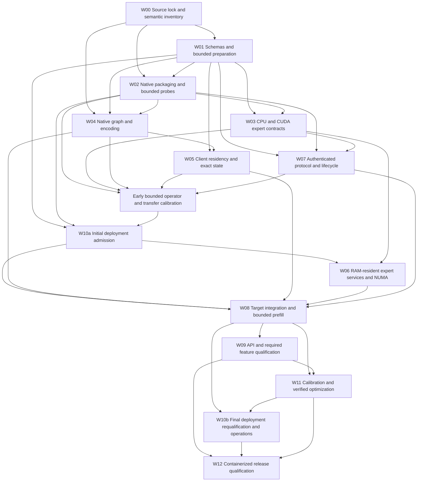

# RIA implementation plan

Implement one native DwarfStar-derived CUDA attention client with managed VRAM/RAM, connected to one RAM-resident expert/Engram server. Implement both explicitly selected CPU and Blackwell CUDA server executors, all three required numerical profiles, bounded prefill, exact continuation, and the two-host Docker operating contract.

This is the implementation plan, not a claim that the runtime or its acceptance gates already work. The planning task includes complete ingestion of the 2,133-line handoff and three independent reviews. Runtime implementation and hardware qualification remain work to execute.

## Authority, repository and evidence

- The imported handoff originally had SHA-256 `14224cdb33476944111e14f69a5679f0597c192a44d67b48f048910f326f3f6e`. The user-authorized optional-certificate revision is mirrored in [docs/ria-specification.md](docs/ria-specification.md) and the original home-directory file: 248,071 bytes; current SHA-256 `1720ef37b3bf1f561501293823973ef1475f65979d351804f45562fff5ce5767`.
- **User correction:** use `antirez/ds4` as the canonical base. This supersedes the handoff's `stefandsl/DwarfStar` selection and its corresponding base-specific references. `stefandsl/DwarfStar` is an optional donor only if an inspected difference serves an evidenced need. The other architecture and acceptance requirements remain in force.
- **User-owned working repository:** [kklouzal/RIA](https://github.com/kklouzal/RIA), a verified fork of `antirez/ds4`. `origin` is the user's fork; `upstream` is `https://github.com/antirez/ds4.git`. The planning branch is `codex/implementation-plan`, initially based on `0aaea5a238fb41a35106a551e73c8409dfb751ac`; both remotes' observed main HEADs matched this commit. This is a checked-out source identity, not a qualified build/dependency lock.
- `/home/kklouzal/AGENTS.md` governs execution. The checkout's `AGENT.md`, `CONTRIBUTING.md`, Makefile and relevant source/test paths were inspected. Use native **C host modules and CUDA**, preserving the base's direct interfaces; do not introduce a C++ host architecture. Python belongs to offline preparation, reference evaluation and deployment tools. The user's required production CPU expert service supersedes the donor's reference-only CPU policy for that service; RIA's memory contract supersedes donor disk-backed inference defaults on the RIA path.
- Keep the task/invariant/evidence state in [TASK_LEDGER.md](TASK_LEDGER.md). Supporting reviews are [model-review.md](planning/model-review.md), [protocol-review.md](planning/protocol-review.md), and [delivery-review.md](planning/delivery-review.md).

The development-host observation in [development-host.json](planning/development-host.json) records Linux ARM64, a GB10 GPU reporting compute capability 12.1, approximately 121.6 GiB total host RAM, Docker Engine 29.6.2 and Compose 5.2.0; `nvcc` was absent from PATH. This observation is not a production probe. The required release baseline is Linux x86-64, rootful Docker, Compose v2, cgroup v2, an RTX 5090/SM120 client and separately qualified expert hardware. Local pure tests and source work are useful; ARM execution, GB10 execution, emulation and the installed Compose release cannot substitute for target-host gates. No access to a remote target host is assumed.

## Fixed implementation contracts

| Contract | Enforcement point |
|---|---|
| One native model/session engine; no second FreeToken, SGLang or LARQL model service | Role-specific initialization and dependency inspection |
| Client learned computation stays CUDA, including head, router, mHC, local experts, attention and vision | Operator dispatch and instrumented host-backed tests |
| Server mode is exactly CPU or CUDA, fixed for the binding; no hybrid substitution | Build capability, configuration, Bind and failure policy |
| All original selected experts, slots, coefficients and masks survive placement | Dispatcher ownership map and complete-result validation |
| A double client expert-cache miss sends inputs for remote arithmetic | Traffic classification and cold-cache integration tests |
| Engram uses exact packed rows/scales; client performs learned fusion | Dedicated row interface, row identity and fusion fixtures |
| Client owns every private state object in local RAM/VRAM | State ownership graph, validity/events/leases and admission |
| Startup and every phase fit distinct host/device/pinned/per-node budgets | One admission engine plus enforcing allocators/counters |
| Incomplete work invalidates generation; no zeros, skipped experts or stale state | Complete layer merge, token commitment and failure injection |
| Prepared artifacts and runtime model values are authenticated and immutable | Source/root trust, logical and physical identities, verified chunks |
| Production uses two host-local deployments, an explicit trusted-network TCP or mutual-TLS policy, and bounded work | Image/deployment locks, effective Compose and physical-host tests |

Native W4A8, NVIDIA NVFP4 W4A4 and the derived FP8/BF16 profiles are different numerical identities. Each profile specifies all scales, activation quantizers, clipping, casts, accumulation and rounding. The required FP8 profile uses E4M3FN values, **32×32 weight-scale blocks, 32-element activation groups and UE8M0 scale semantics**, including the source's power-of-two rounding behavior. A hardware K-axis microscale layout cannot silently replace that quantizer. BF16 widening does not recover absent master weights. Native attention/cache/Engram precision remains independent of the expert profile.

The expert graph retains asymmetric gate/up clamps, coefficient application before down-projection quantization, shared evaluation once and routed accumulation in the pinned reference order. Preserve each projection's calibration and full reduction domain across devices, tiles, NUMA shards and prompt groups. Local and remote inputs must represent the same logical rounded values. Freeze independent same-realization placement comparisons and native-source profile comparisons in `validation-policy.json` before inspecting optimized results.

Start with the **full-reference exact schedule**. Implement the model's CED/CSA2 operators and source aliases, but qualify a faster encoder-oriented CED schedule only when decoder SWA initialization, continuation and state match the exact baseline. Approximate bounded replay is outside acceptance. The latest emitted token may not yet be incorporated into state; committed history, incorporated positions, sampled token, emitted output and RNG state need separate fields.

## Dependency order and work that can overlap

The arrows represent qualification dependencies. Implementations and packaging evolve together; compiling a component can precede its physical acceptance gate. W04 supplies graph/operator/state contracts before W05 completes its manager; the assembled full-reference graph/state gate belongs to W08. W06's service implementation is built before W10a uses its image identity, while W06's full-bank readiness gate follows that admission.

After the shared semantic/schema boundaries are fixed, independent CPU expert, CUDA expert, attention/state and protocol/container tracks can proceed in parallel. Use disjoint file ownership and common fixtures; the integrating owner reviews claims and runs cross-track checks. **Early fixture calibration → W10a initial admission → W06/W08 full-bank/full-model execution → W11 integrated calibration/optimization → W10b final requalification** is the explicit resource dependency. Probe and small-fixture calibration do not require a full model to be admitted. A working decoding demo does not defer bounded prefill or exact continuation.

## Work packages and exit gates

### W00 — Establish reproducible sources and executable semantics

**Depends on:** repository checkout and the supplied requirements.

1. Preserve the current fork base and audit its relevant V4.1 code, tests, source dependencies and documented commands. Pin any necessary upstream update deliberately, with its diff and fixtures. Record actual imported files and patches, FreeToken main/PR material only where needed, model/reference/encoding revisions, NVIDIA conversion/calibration/integration, kernel dependencies, licenses, toolchains and runtime targets. No moving branch is a release input.
2. Acquire reviewed compact configuration, encoding/tokenizer metadata and shard headers/indexes first. Generate tensor-to-operation coverage, tied aliases, active/server/client populations and deliberate inactive-feature exclusions. Validate the inspected 40-layer/5120-width/384-expert/6-selected target against pinned files, including the omitted RoPE, compression, norm, index, vision and Engram fields.
3. Extract a mathematical contract for every used operation and state transition. Trace both expert projections through the publisher-cited integration and reconcile its scale/coefficient/cast ordering with the selected source graph. Frozen full-population calibration statistics belong to the prepared operator identity.
4. Define independent small and real-dimension operator fixtures, teacher-forced evaluation at all required positions and a reviewed validation policy. Define determinism scope, masked labels, corpora, seeds, rounding/math settings and per-profile/operator error criteria; do not promise cross-platform bit identity.

**Outputs:** `locks/source-lock.json`, import/notice inventory, generated tensor/operator/state inventory, `validation-policy.json`, fixture provenance and a source-gap report. **Exit:** no unexplained required tensors or semantic discrepancies; strict W4A4 has an independent oracle. Full checkpoints/builds remain separately reported evidence.

### W01 — Implement schemas, identities and bounded artifact preparation

**Depends on:** W00 logical/numerical contracts; preparation can proceed shard by shard.

Implement strict schemas for root/manifest, operator contract, physical layout, service/probe/deployment requests, deployment lock, memory plan, calibration and protocol. Add cross-field validators; rejecting unknown fields, duplicate keys and unsupported graph kinds is a boundary contract. Ordinary JSON integers stay in the safe-integer range; unrestricted u64 IDs/offsets are schema-fixed decimal strings. Exact numerical scalars use typed bits or tensor bytes where required.

Use RFC 8785 JCS and SHA-256 for project identity. Test Unicode ordering, escaping, numbers and u64 string boundaries in native C and preparation tools. A manifest excludes only its top-level `digest`/`signatures` from its digest. Keep logical model/profile identities separate from approved CPU/GPU physical layouts. Derive checked handles deterministically with collision detection; serialized pointers or filesystem paths are never remote handles.

Build a defensive safetensors reader and streaming preparer: checked data-area-relative offsets, byte sizes, dimensions, alignment, duplicate/overlap handling and exact reads. Preserve valid packed source bytes; derive FP8/BF16 and kernel layouts reproducibly without full-model expansion. Publish synchronized completed shards atomically on the same filesystem and the final manifest last; resume only verified boundaries.

Create authenticated verification chunks of at most 4 MiB, including scales and deterministic padding. The pre-provisioned trusted root authenticates bounded metadata/index objects before dependent chunks. Reject cycles; authorize every returned verification-chunk byte, including overfetch. Segregate differently authorized populations where necessary. Count source/output/in-progress/calibration disk peaks and metadata/staging RAM.

**Exit:** source-independent identity fixtures; malformed/truncated/overflow/fuzz tests; partition-invariant conversions; interrupted publication never appears complete; verified client subsets can prepare without fetching the full model.

### W02 — Build native targets, images and independent probes early

**Depends on:** W00 source/toolchain choices; use tiny prepared fixtures from W01.

Add `package-cpu` and `package-cuda` to the existing Makefile. CPU packaging includes only the expert service/control tool and CPU/NUMA/TLS dependencies. CUDA packaging contains `ds4`, `ds4-server`, CUDA expert service, `ds4ctl` and required native kernels. All linked host libraries must support the declared x86-64 baseline; remove build-host ISA selection from redistributable targets.

Retain the existing accelerated SM120 mapping where validated; package the required RTX 5090 kernels explicitly as `CUDA_ARCH=sm_120a`. Audit host `-ffast-math`, NVCC `--use_fast_math`, TF32/FMA/denormal behavior and library defaults against each operator contract. Use a semantics-safe baseline and admit changed math only with the required evidence. Build without GPU autodetection; prove emitted instructions, target shapes and launch resources on the actual GPU. A missing kernel requires a native/AOT port behind the operator boundary.

Provide strict `ds4ctl probe` with its own bounded configuration and no final-plan/model-readiness requirement. Probe CPU/NUMA masks, self-allocation, lock limits, cgroup ceilings, dumpability and the selected GPU's UUID/SM; launch representative block-scaled FP4/FP8 and BF16 kernels. CPU probes never initialize CUDA. Pair the container probe with host preflight for topology and parent limits.

Use digest-pinned multi-stage CPU/CUDA Dockerfiles, locked offline dependency inputs, non-root UID/GID, build-info/schema/notices installation, SBOM and provenance. Extract the handoff's embedded deployment templates mechanically and retain source offsets/hashes; adapt only through reviewed generators or owned template inputs. Scan contexts/layers for weights, credentials, private data and accidental build-only dependencies.

**Exit:** independently buildable CPU artifacts; supported native kernel probes on target hosts; probe evidence explicitly precedes final admission. Full runtime image qualification occurs after later packages, not at scaffold completion.

### W03 — Implement one expert operation with CPU and CUDA executors

**Depends on:** W00–W02 operator contracts and tiny verified banks.

Extract selected-expert execution from the full engine. Its descriptor resolves verified projections/scales and exposes bounded row/expert work, logical dtypes, original slots/coefficients, quantizer context and complete contributions. It never routes again or initializes attention/KV. Implement NVFP4 W4A4, block-scaled E4M3FN W8A8 and BF16 with their exact clamp, calibration, rounding and sensitive FP32 behavior.

Implement CPU quantization/packed decoding/arithmetic with bounded scratch and capability-checked ISA kernels. Software arithmetic may express unsupported low-bit types correctly; that does not establish adequate speed. Implement CUDA decode and grouped-prefill/tiled paths without whole-layer residency. Client CPU code only gathers/copies prepared bytes; CUDA handles its numerical unpacking and expert math. CUDA-server misses remain CUDA operations.

Compare every backend with the independent same-realization fixture. Test all codes/scales/extrema, zero/saturation/odd boundaries, gate versus up clamps, coefficient placement, shared branch, output casts and full quantizer scope across partitions. Include deliberate W4A16 and wrong-normalization/order negative cases.

**Exit:** all profiles pass declared operator policies at real target dimensions; smallest executable tiles/workspaces are measured; large byte strides survive host and device interfaces. Neither donor dtype support nor one successful GEMM constitutes expert qualification.

### W04 — Adapt the existing V4.1 graph and native encoding

**Depends on:** W00 semantic inventory and W01 tensor/layout descriptors; use W03/W05 boundaries while integrating.

Audit and adapt existing V4.1 graph/CUDA modules instead of rebuilding another model engine. Replace whole-model mapping assumptions with checked tensor handles; an absent client expert is a remote-capable descriptor, never a fake pointer. Keep embeddings/head, shared branch, router, mHC, attention/index/compression and learned Engram fusion on client CUDA.

Qualify CSA2 Full/Reindex/Reuse, separate KV/index source aliases, hierarchical newest/partial candidate blocks, SWA, RoPE/compressed positions, sinks, quantized caches, Single-Pass mHC and modality-aware routing. Preserve the flattened mHC normalization versus per-stream Engram normalization. Backend selection is an operator-and-phase matrix; generic MLA compatibility or SM100 support is insufficient for SM120.

Use native encoding or a token-identical adapter. Test reasoning effort/history dropping, generation prefixes, messages/tool schema/result ordering, object-versus-string tool arguments, special IDs and image placeholders. Extend nonzero-position prompt chunks deliberately; a decode-only reference helper or initial-only image assertion cannot be reused unchanged. Expose logits at all teacher-forced positions with shifted-label masks.

**Exit:** source-qualified graph/encoding/operator fixtures, complete state-dependency contracts and a specified full-reference exact schedule. The assembled graph plus complete state-manager baseline executes at W08, avoiding a completion cycle with W05. An existing GGUF completion is a donor regression result, not source/NVIDIA RIA profile fidelity.

### W05 — Manage client weights, private state and immutable caches

**Depends on:** W01 handles/layouts and W04 producer/consumer semantics; implement alongside the graph.

Create one explicit owner for separate host, device and CUDA-pinned budgets. Reserve mandatory state, activation, accumulator, workspace and progress pools before optional caches. Model startup, prefill, decode, continuation, image work and cancellation peaks; source aliases count once per actual copy, alternate layouts/replicas/staging copies count separately.

Track each private object's logical positions, session/epoch, representation, producer, generation, dirty ranges, valid copies, events and reader leases. Implement host-valid/copying/device-valid/dirty/writeback/invalid transitions and valid simultaneous copies. Copies publish validity only on completion. Dirty state cannot lose its last current copy; recycled rings and shared aliases remain generation-safe. Move historical packed bytes without requantization.

Use bounded reusable pinned pools and execution slots for non-routed weights, head/shared/vision tiles, expert host hits and selected state pages. Preserve quantizer scope and partial sums across tiles; exact streaming softmax keeps a running max/denominator/numerator, handles empty blocks and reference sinks. Broader index scans count alongside final KV gathers. Avoid stable-state rediscovery in hot loops.

Engram host/device caches are separate and permit zero capacity. A complete host-only expert may stage locally or execute remotely under a saved phase plan; a double miss always evaluates remotely. Never use disk/swap, remote private state, Unified Memory faults or client CPU inference as capacity escapes.

**Exit:** bounded manager/operator fixtures, resident/paged state parity, dirty/partial-group/ring/alias/cancel stress, and measured allocation/transfer bounds that permit initial admission. W08/W12 additionally require constrained-VRAM full target execution with a footprint that actually exceeds VRAM, zero CPU neural work and progress with zero/tiny caches; this integration gate does not block constructing W05's manager.

### W06 — Load strict RAM-resident expert services and implement NUMA

**Depends on:** W01 prepared populations, W02 packages and W03 expert executors. Full-bank loading/readiness follows early fixture calibration and W10a admission; the service code and image can be built before that physical gate.

Initialize only the expert/row service and explicitly declared shared work. Load canonical active tensors, necessary alternate layouts and intentional replicas into admitted resident host arenas; prefault/lock and verify physical placement before readiness. Disk is restart storage. No reclaim/reload-dependent serving or full-population CUDA registration is allowed.

Implement CPU `sharded`, `replicated_experts` and `replicated_server_model` policies with coarse per-node arenas, node-local scratch and bounded affinity-aware pools. Count every physical copy, each node's actual capacity, process mapping limits and startup peaks. Replicated mappings/affinity alone do not prove replicas; verify independently placed immutable pages and hashes. Schedule each remaining selected expert once; extra nodes need independent rows or a separately validated intra-expert partition. Avoid nested pool oversubscription and reserve networking progress.

Implement CUDA bounded cache/transient slots: upload distinct row inputs once, lease complete hits, stage missing packed projections/scales from host RAM, execute qualified subgroups and return complete contributions after successful D2H. The selected union may exceed VRAM. Place staging near the GPU when useful and measure cross-node reads, local PCIe and NIC contention.

**Exit:** actual-ISA driver-free CPU service; Blackwell CUDA miss/prefill paths with zero CPU expert math; real per-node placement/admission for all required NUMA policies; no duplicated attention/router/KV stack.

### W07 — Implement the exact selected-transport protocol and lifecycle

**Depends on:** W01 schemas and W02 runtime foundation; parser/lifecycle work can precede complete executors. Final reservation tables additionally require W03 measured workspace.

Implement persistent TCP under an explicit policy: mutual TLS 1.3 by default (mutual certificates, SAN verification and no early data), or certificate-free trusted-network TCP selected with exactly `tls: {"enabled": false}` on both hosts. Never infer plaintext from missing credentials or handshake failures. Exact model/role permissions remain required; trusted-network grants use `expected_peer_name: null` and provide no cryptographic peer authentication. One control/expert/row connection and one bounded bulk connection share the same peer/binding. Use the specified 64-byte `DSER` little-endian revision-1 header, exact operation registry/statuses and payload equations; never serialize native structs. Parse fragmented/coalesced application streams under both modes with checked type-specific limits before allocation and exact final consumption.

Bind common logical/operator/encoding identities and approved physical layouts, placement plan, mode, handle grants, shapes, count/byte limits and deadlines. Initial zero-to-nonzero session installation occurs only in successful Bind. Bulk Bind consumes a fresh one-use capability for the same session/epoch and selected peer policy (authenticated leaf certificate in TLS mode; numeric peer IP, including IPv6 scope, in trusted-network mode). No giant inventory is transmitted in control JSON. Nonmonotone IDs, wrong epochs/kinds/flags, duplicate replies or corrupt payloads cannot reach state.

Implement expert/shared requests, Engram rows/scales, authorized verification chunks, cancel, health and orderly close. Preserve authoritative outstanding row/slot maps; success includes every expected contribution. Canonical accumulation follows expert identity, never response arrival or request grouping.

Reserve deterministic count-and-byte credits and worst-case response/workspace before admission. Independent progress slots cover at most two expert requests, two row lookups, four lightweight controls and one bulk chunk within the shared byte cap. Protect an explicit **byte subbudget** inside that cap for parser/error/cancel/Close progress; expert, row and bulk work cannot consume it. Agreed credit charges are shared protocol accounting; actual allocations remain separately admitted at each endpoint. Use monotonic operation deadlines distinct from partial-frame, write and handshake deadlines. Cancel acknowledgements do not release target credit; the target produces one terminal result/error after quiescence, or the binding becomes invalid when failure prevents a reply. Keep the specified bounded 16-terminal-ID history.

The established bulk channel stays open until whole-binding Close. Ambiguous capability consumption or a lost bulk-Bind reply closes both channels and requires a fresh binding/capability; no bulk reconnect is attempted. Initial control/bulk binding and required bootstrap share a finite configured startup deadline. A binding epoch isolates stale work and may contain consecutive successful client generations, each with its own private identity. Counters never wrap: drain and rebind before exhaustion. Any failed required expert/row operation invalidates its generation; the baseline drains/retires that binding before fresh-session replay. An ordinary successful nonoverlapping generation may continue/reuse the healthy binding under the proven-prefix contract.

**Exit:** independent byte/JCS/lifecycle fixtures, both-mode transport/grant integration, adversarial parsing and terminal/cancel/credit races; no-buffer progress; disconnect invalidates both channels and generation; no automatic uncertain-work retry or backend substitution.

### W08 — Integrate the target path, bounded prefill and exact continuation

**Depends on:** W03–W07; this is the first full RIA inference gate.

Run client graph to normalized input/router; assign each `(epoch, logical invocation, row, layer, selected slot)` exactly one owner. Submit bounded remote subsets while executing legal local/shared work, validate all expected contributions, reduce canonically and advance dependent graph work only after complete success. A logical invocation can span several unique subrequests; it cannot be reused for a new invocation.

First qualify all-remote target execution with CPU and CUDA server modes and the strict NVFP4 realization. Then expand FP8/BF16 and all client placements. This ordering is an integration milestone; it does not reduce final scope or introduce success-shaped temporary results. Reference evaluation may require larger memory or bounded independent evaluation; record its actual coverage.

Implement bounded prompt chunks, expert/row grouping, scatter association, phase-specific staging and protected/transient caches. A prompt may touch all 384 experts; whole-layer or full-union expansion is forbidden. Quantization is invariant under group size. Streaming cannot conceal incomplete layers.

Implement exact append to a proven matching incorporated prefix, including image/content, encoding/profile/schedule identities and pending-token/RNG boundaries. When newly encoded reasoning/tool/image history diverges earlier, invalidate private state and re-prefill exactly under a fresh binding. Recovery deterministically replays committed history; emitted tokens are preserved. No KV-only rollback or durable resume is implied.

**Exit:** initial/continued prefill and decode parity across all placements; real two-host activation/contribution traffic; double misses never request expert matrices; fault injection shows no output from incomplete math or uncertain state.

### W09 — Qualify the user API, reasoning/tools and native images

**Depends on:** W04 encoding, W05 staging and W08 commitment/cancellation.

Reuse `ds4` and `ds4-server` with `--config`. Qualify `GET /v1/models` and `POST /v1/chat/completions` first; other inherited adapters remain explicitly unsupported until their encoding/stream fixtures pass. Only the target/profile identity is advertised. Validate the supported model/message/sampling/reasoning/tool/image subset; one completion and one active generation, with zero queued generations initially. Reject unsupported settings rather than ignore them. Tool calls are returned, never executed.

Require a file-provisioned bearer token before expensive work, including loopback use. Bound headers, bodies, JSON nesting, message/tool expansion, decoded images and GPU/token expansion; remote image fetching stays disabled. Bound SSE output and cancel abandoned/stalled consumers while retaining the generation slot until work quiesces. Handle UTF-8/tool fragments and emit usage/terminal success once; a fault after streaming closes with error and no successful completion.

Preserve and qualify native image processing, learned encoder/projector, positions, masks, span routing bias and continued/chunk-crossing image behavior. CPU image decoding/control is permitted; learned work and serving-time numerical row decode/fusion remain CUDA on the client. Text-only bring-up is useful, but does not finish the required image qualification. Keep MTP/speculation/agent/disk-state features disabled on the RIA baseline.

**Exit:** native text/reasoning/tools/multi-turn fixtures, API security/streaming/cancel tests, and separate real-dimension vision plus whole-model image fidelity and capacity evidence.

### W10 — Finalize deployment, readiness and bounded recovery

**Depends on:** W01–W02 schemas/probe and early measured operator/residency/transport bounds for initial admission. Final requalification additionally consumes W05–W08 full-run peaks and W11 integrated evidence. Develop template/structural checks earlier.

Implement `ds4ctl validate`, `probe`, `plan`, `health` and `drain`, plus `tools/render_deployment.py bootstrap/finalize`. Keep a single native C admission engine: Python orchestrates its structured inputs/results rather than reimplementing memory equations. Bootstrap emits a bounded probe deployment marked `not_admitted`; finalize requires actual probe, inventory and calibration. If final device/image/caps/security settings change, re-probe them before admission.

**W10a:** before full-bank/full-model execution, run separately admitted bounded operator fixtures using W03 expert and W04 attention/state fixtures, W05 pool accounting and W07 test-sized TLS/framing. Measure per-profile/shape workspace, gathering, H2D/D2H, node-local/remote reads, row/chunk traffic and authenticated request/reply curves under intended restrictions. Use those measurements plus exact inventory/state growth equations to finalize the initial host-role packages. This calibration harness contains reviewed test data and no full-model admission dependency. **W10b:** after W08/W11, compare actual peaks and final selected policies with those bounds, re-probe/recalibrate changed inputs, and regenerate/requalify the final packages. Bound regeneration attempts; incompatible evidence produces a clear unresolved-input result rather than an endless loop or fabricated measurement.

Follow a noncircular identity order: reviewed sources/model/layout → native build → completed image → probe/calibration → memory plan → service file → effective Compose → external deployment lock. The service references the lock's **path**, not its digest. Images embed build metadata, never their own final digest/deployment lock. Define any deployment-lock identity explicitly without adding a cycle through service/plan contents.

Generate the CPU expert, CUDA expert overlay and client Compose deployments separately. Use controlled interpolation environment/file order; never execute `.env` as shell code. Compare normalized `docker compose config --format json` with the approved contract before launch and actual `docker inspect` after creation. Test inherited variables, paths with spaces/dollars, mounts, ports, UUIDs and settings. No cross-host `depends_on` or localhost peer assumption.

Enforce positive equal `mem_limit`/`memswap_limit`, finite full-residency memlock, per-node placement, tmpfs/stack/TLS/socket/cgroup overhead, bounded reports and cgroup-parent limits. Derive the minimal NUMA seccomp profile from the pinned Engine default, preserving unrelated restrictions and constraining any `move_pages` to self-query. Keep non-root UID, dropped capabilities, no-new-privileges, read-only root/model/config/secrets, restricted listeners and exactly one selected GPU. Provision actual secret file permissions; do not rely on Compose ownership remapping.

Set `RLIMIT_CORE=0` and `PR_SET_DUMPABLE=0` before sensitive loading, with appropriate `MADV_DONTDUMP`. Expert readiness depends only on its local loaded/locked artifacts, executor, reservations and authorized listeners. Client readiness additionally requires binding/bootstrap and its kernel/memory plan. Busy is healthy. SIGTERM stops admission and drains safely within tested grace; sticky CUDA errors or nonquiescent executors remove readiness and terminate nonzero. No global GPU reset, host security disablement or infinite restart loop.

**Exit:** final environment matches locks, measured startup/drain, local management-socket permissions and health; offline runtime; explicit mode changes through stop/recreate/rebind; authorized-host networking and fault tests in release containers.

### W11 — Calibrate, compare and retain evidenced optimizations

**Depends on:** independent correctness gates and W08 end-to-end baseline for integrated comparisons. Early fixture calibration belongs to W10a and precedes full-model admission; W11 refines and verifies that calibration with end-to-end evidence. Repeat when source/runtime/workload/limits change.

Define REGIONs by profile, server executor/topology, client backing/cache budgets, phase, context/image workload and warm/cold runtime state. Set the ordered objectives below and record actual hard budgets in the plan/calibration before accepting candidates. The specification supplies no tokens/s guarantee, so no numerical speed threshold is fabricated.

| REGION | Ordered end-to-end objective after hard correctness/resource constraints |
|---|---|
| Cold preparation/startup | Time to admitted readiness, then peak resource/cost reduction |
| Initial or continued prefill | Time to first committed token, then prefill throughput and transfer/resource cost |
| Ordinary decode | p99 inter-token latency, then p95/median latency, committed-token rate and resource cost |
| Long-context/image/continuation | Corresponding request/step tail latency, then capacity and resource cost within the fixed quality contract |

Profile execution/copies/network/NUMA waits and model structural alternatives. Compare applicable native/library/AOT kernels, packed layouts, bounded row/expert tiles, retained versus proven-exact CED, client host-hit local versus remote choices, sharding/replication, server residual-workload caches, gather/registration/staging, page sizes, legal overlap/prefetch and optional graph segments. Additional protocol aggregation needs its own reduction identity and validation; per-expert replies remain the baseline.

Every candidate gets a semantic validity check, integrated representative benchmark, uncertainty and per-REGION outcome. Include warm/cold distributions, p95/p99, startup, peaks, bytes by transfer class, throughput and broad routing traces larger than caches. Control versions, inputs, cache state, warmup, run order/count, temperatures/power, clocks and background/service load. Microbenchmarks identify opportunities; equal-workload integrated evidence decides retention. Delete dominated task paths, preserve required variants and complete a post-change bottleneck review.

**Exit:** saved reproducible phase plans, measured bounds and candidate outcomes; no gain hidden by uncounted copies/startup, changed quality, skipped operations or an averaged required-path regression.

### W12 — Complete the release matrix and publish reproducible evidence

**Depends on:** W00–W11, actual target artifacts, devices, CPU/NUMA capacities and deployment inputs.

Run all required combinations **inside the final images**: three profiles × two server modes × resident-reference and explicit host-backed client conditions. For each, cover placement and phase cases below. Larger reference hardware or bounded independent references are acceptable only with their actual scope recorded. A mode/profile/NUMA/image gate lacking physical resources stays incomplete; metadata or toy fixtures cannot complete it.

Run target-model operator/state/layer/model/feature comparisons, pressure/security/failure suites, native-versus-container matched workloads and at least a **one-hour mixed-workload engineering soak** under production security/memory policy. Use the linked delivery review's **G01–G28** as the detailed acceptance checklist; compressed wording here does not relax its source-grounded API/launcher/security cases. Preserve raw results and exact source/model/build/image/config/plan/environment identities. Triage findings, finish every discovered candidate and update support matrices/runbooks before declaring completion.

Release integrated source and patches, locks, schemas/tools, profile/state/protocol fixtures with provenance, CPU/CUDA packages, digest-qualified image references, SBOM/notices, seccomp source/diff, Compose/render/launch tooling, capacity/calibration reports, fidelity/failure/performance/soak evidence and reproduction commands. Do not distribute credentials, private prompts or restricted weights. Report numerical qualification, memory fit and achieved performance separately, including any desired deployment target missed by a functionally correct mode.

**Exit:** every applicable requirement/gate has passing reproducible evidence and no unresolved implementation placeholder or advertised untested capability.

## Initial repository integration map

These paths are present in the checked-out base. Audit their callers/ownership before editing; source symbols and line numbers are not stable public contracts. Extend the existing module when responsibility fits; new names below describe responsibilities rather than a required class/file hierarchy.

| Existing owned surface | Planned responsibility |
|---|---|
| `ds4.c`, `ds4.h` | V4.1 graph/session adaptation, checked tensor handles, selected-work boundary, canonical merge and exact commitment |
| `ds4_gpu.h`, `ds4_deepseek41_gpu.h` | Bounded operator/tile/subset and event/lease contracts |
| `ds4_cuda.cu`, `ds4_deepseek41_cuda.cuh` | Qualified profile math, SM120 attention/index/state/local-expert operations and tiled execution |
| `ds4_engram.c`, `ds4_engram.h` | Preserve reviewed hashing/history; separate packed resident/remote row retrieval from donor disk/CPU-decoded serving behavior |
| `ds4_image.c`, `ds4_image.h` | Native preprocessing, validated expansion and CUDA vision integration |
| `ds4_prompt_prefix.c`, `ds4_cli.c`, `ds4_server.c` | Exact rendered-prefix checks, CLI/API adapter, streaming commitment and safe cancel |
| `ds4_linux_memory.h`, focused residency/NUMA modules | Budget enforcement, checked allocation/locking/placement, host/device validity and progress resources |
| Focused tensor/preparation, expert, protocol and service modules | Role-specific initialization and shared narrow contracts; no full model engine in server |
| `ds4_distributed.c`, `ds4_tp.c` | Inspect reusable utilities; existing layer/TP protocols do not become expert RPC through renaming |
| Makefile, `tests/`, `docs/` | Packaging, independent conformance/profile/state tests, evidence and non-obvious public contracts |
| New `locks/`, `schema/`, `protocol/`, `tools/`, `deploy/` artifacts | Immutable inputs, one authoritative schema/generator model, preparation/admission, deployment and operating contract |

Keep unrelated upstream functionality intact. If a shared loader, interface, numerical helper or API change reaches Metal/SSD/layer/TP callers, add the applicable inherited correctness/speed regressions on qualified hardware. Required RIA variants are intentional contracts; do not add speculative compatibility, alternate full engines or hand-edited generated bindings. Do not modify vendor/installed dependencies in place.

## Decisions to close before their dependent gate

| ID | Decision/input | Resolution owner and evidence | Dependent gate |
|---|---|---|---|
| D01 | Coherent model, source, publisher, kernel, toolchain and base-image pins | W00/W02 source and build locks; verified hashes and notices | All implementation imports/release |
| D02 | Strict W4A4 scale/coefficient/quantizer sequence; all numerical thresholds | W00/W03 independent reference contract and reviewed policy | Expert/profile fidelity |
| D03 | State dependencies/growth and exact chunk/CED semantics | W04/W05 all producers/readers and retained-state/chunk fixtures | Paging/continuation and context admission |
| D04 | Actual CPU ISA, DIMMs/NUMA capacities and supported Blackwell targets | W02 physical probe; W06 real kernels/pages | CPU/CUDA/NUMA qualification |
| D05 | Actual active tensor bytes, converted layouts and preparation/runtime peaks | W01 inventory and W05/W06 allocation/residency reports | Profile-specific capacity |
| D06 | Deterministic credit reservation and minimum viable units | W07 schema-bound size/workspace equations, both-peer differential tests | Protocol admission/progress |
| D07 | Internal generation error versus binding-fatal failure, initial/existing bulk lifetime | W07 transition table; explicit start-up/close/disconnect races | Cancellation/recovery |
| D08 | Tie conventions, sampling/RNG replay and emitted/unincorporated token accounting | W00/W04/W08/W09 fixtures and safe request metadata | Determinism/state/API fidelity |
| D09 | Peer addresses/selected transport policy and optional PKI, selected UUIDs, allowed CPU/node sets and actual file permissions | W10 provisioned inputs plus inside-container validation | Deployment/binding |
| D10 | Context/image/resource/deadline limits and any operational latency target | W05/W10/W11 measured admission and saved REGION policies | Readiness/performance |
| D11 | Tested Engine/Compose/driver/toolkit/seccomp/library environment | W02/W10 locks, actual probes and effective container inspection | Docker release |
| D12 | Full model and replica/reference test hardware availability | W12 physically executed coverage; explicit unrun cells otherwise | Complete release matrix |

D06 must not depend on private server estimates a client cannot reproduce. Publish bounded per-operation/profile workspace coefficients or an immutable reservation table in the checked bind contract, use the same credit-charge calculation at both ends, and include non-payload storage. Independently enforce each endpoint's real allocation equations and protected progress-byte reserve. D07's baseline bulk lifetime, lost-Bind response and fresh-generation/binding rules are fixed in W07; implement a status/event transition table covering preadmission refusals, required neural/row failure, malformed control, cancellation, disconnect and fatal process failure. A fatal process/network failure can prevent a terminal reply; binding invalidation replaces that impossible liveness promise while still forbidding result/credit reuse.

These are implementation prerequisites rather than open architecture choices. They do not require reopening the settled topology/model or inventing answers now. Source/probe work can determine most of them; deployment access, credentials and any desired operational threshold require real operator inputs.

## Structural capacity and transport checks

Using the inspected dimensions only, routed projections contain `40 × 384 × 3 × 5120 × 2304 = 543,581,798,400` values. Values alone occupy 253.125 GiB at four bits, 506.25 GiB at eight bits and 1,012.5 GiB at BF16. Add actual scales, padding, Engram, non-routed/vision tensors, alternate layouts, replicas, workspace and startup copies. These are planning lower bounds, not actual prepared sizes or an invented hardware floor.

The cited NVIDIA artifact is approximately 492 GiB; 512 decimal GB is approximately 476.84 GiB. Even a 512 GiB server leaves little headroom at that artifact size. FP8/BF16 and replicated policies require separate inventory-derived fit decisions and potentially larger hardware. Retain all active experts and exact Engram; an insufficient host produces an honest failed admission. The [publisher card](https://huggingface.co/nvidia/DeepSeek-V4.1-Flash-NVFP4) supports the artifact estimate, not a measured RIA footprint.

At protocol defaults, `R=64`, `E=384`, `D=output_width=5120`, `Q=0` gives a 1,314,604-byte expert request and a 7,864,352-byte reply. Two payload pairs alone need 18,357,912 bytes, before workspace, local contributions, TLS/socket buffers, rows/bulk and progress. Both individual frames fit 16 MiB; that fact does not prove total admission. One all-remote row carries 143,496 payload bytes, approximately 140.13 KiB, excluding the two headers and TLS. Sum over the actual schedule, not a presumed universal per-token layer count.

CPU replicas must fit independently on each intended node; additional aggregate RAM or duplicate mappings do not establish locality. CUDA execution must fit the smallest supported tile/subgroup plus buffers, even with a zero cache. Client RAM, VRAM, OS memlock and CUDA pinning are distinct quantities. No installed or advertised capacity is accepted as usable without probe/peak evidence.

## Verification matrix and commands to implement/discover

| Evidence level | Required coverage | Execution location |
|---|---|---|
| Pure conformance | Strict schemas/JCS/u64; exact header/lengths/CSR/rows; hash-root/chunk permissions; accounting, lifecycle and template extraction | Development host without model/GPU |
| Native CPU | Independent expert/profile arithmetic, actual target dimensions, parser/static/sanitizer/worker/cancel checks; no CUDA dependencies | Actual server ISA; driver-free qualification host |
| Native CUDA | Real SM120 accelerated FP4/FP8/BF16 plus graph/index/state/vision; launch/stride/alignment/lease/allocator diagnostics | RTX 5090 and each declared server GPU |
| Full model | Teacher-forced loss/logits at declared positions, graph/state parity and text/reasoning/tools/images | Verified artifacts on sufficient target/reference hardware |
| Deployment | Effective Compose/inspect, cgroups/memlock/seccomp/dump safety, permissions, readiness/startup/drain and offline operation | Release images on required x86-64 hosts |
| Physical distribution | TLS/authorized-host firewall, input/contribution/row/chunk association, control+bulk loss and cold misses | Two physical hosts on real network |
| Performance/reliability | Matched native/container comparisons, wide routing/context traces, cold/warm distributions and one-hour mixed soak | Final admitted deployment REGIONs |

The core 12 profile/executor/residency cells are expanded with all-remote, VRAM-hit, host-only-local, host-only-remote and mixed placements; initial prefill, ordinary decode and continued prefill; zero/tiny caches; and broad prompt expert unions. Test all three NUMA policies for correctness/capacity, with actual replica performance only where each node fits. Resident-reference work that needs larger hardware is explicitly recorded. Images have their own operator, chunk/continuation and whole-model gates.

Boundary/failure coverage includes malformed/oversized/duplicate/nonfinite data, arithmetic overflow, exact lengths, wrong identities, stale epochs, out-of-order/duplicate results, selected-mode disagreement, TLS/certificate failures when enabled, trusted-network peer/capability mismatch, exact grant/authorization failures, no credits, slow/partial reads/writes, cancellation before/during/after execution, terminal races, chunk corruption and interrupted prep. Resource/state coverage includes copy/worker/kernel faults, allocation/registration failure, dirty-page cancellation, ring/source/partial-compression boundaries, control or bulk loss, server restart, cgroup OOM, report exhaustion, sticky CUDA events, SIGTERM/SIGKILL and sampled-before-incorporation failure. Prove no stale writer can reach reused buffers.

Explicitly test binding epoch versus private generation, legal invocation sharing across microbatches, uniqueness for new invocations and counter exhaustion/rebind. Large-address gates include canaries around **2 GiB and 4 GiB**, synthetic checked bank/file/kernel-address calculations beyond **4 GiB and 1 TiB**, and representative actual device allocations/strides where available. Promote operands before multiplication through every host/device boundary. Synthetic success and real device/high-capacity qualification are separately named results.

Existing checkout commands include `make cpu`, explicit `make cuda CUDA_ARCH=sm_120a`, `make test`, `make cuda-regression`, `make test-engram`, `make test-linux-memory` and V4.1 test targets. Their exact prerequisites/flags must be rechecked at the locked source; inherited GGUF/vector tests do not cover RIA profiles. New named targets should separate pure conformance, CPU reference/executor, compiled CUDA, protocol integration, Docker and physical-host model/benchmark suites. `package-cpu`, `package-cuda` and the specified `ds4ctl`/renderer interfaces are required implementation outputs, not working commands today.

Run complementary compiler diagnostics, applicable type/lint/schema checks, ASan/UBSan, concurrency stress/TSan where supported and CUDA memory/race diagnostics against changed contracts. Validate JSON/YAML with duplicate-aware parsing, Dockerfile and shell syntax, Markdown anchors, all three rendered Compose combinations and dangerous-setting exclusions. Static parsing never replaces actual Compose, image build or device execution. Preserve full logs and return codes in bounded durable artifacts.

## Requirement and section traceability

| Locked requirement | Work packages | Passing evidence |
|---|---|---|
| MODEL | W00, W01, W04, W08, W12 | Verified V4.1 artifact/config/encoding and full target tests |
| GPU | W02–W05, W12 | RTX 5090 SM120/accelerated instructions and separately qualified server SM |
| CLIENT | W03–W05, W08, W09 | Instrumented zero CPU neural execution, including host-backed/vision paths |
| HOST | W01, W05, W08 | Real RAM-backed weights/state and bounded meaningful caches |
| SERVER | W02, W03, W06, W12 | Qualified driver-free CPU and CUDA expert-only execution |
| MODE | W06, W07, W10 | Immutable explicit binding; new session for mode change |
| NUMA | W02, W06, W11, W12 | All policies, real pages/replicas, per-node fit and job ownership |
| PROFILE | W00, W01, W03, W12 | Three full numerical contracts and both fidelity axes |
| ROUTE | W03, W04, W07, W08 | Preserved original selected work, coefficients/masks and canonical merge |
| MISS | W05, W07, W08 | Cold double misses evaluate remotely; traffic contains no demand matrix fetch |
| STATE | W04, W05, W08 | Exact aliases/generations/continuation and retained/paged parity |
| CAPACITY | W01–W03, W05, W06, W10 | Minimum executable units and all phase/startup/per-node peaks fit |
| SAFETY | W01, W05–W10, W12 | Admission failure, quiescence, invalidation and no substituted output |
| EVIDENCE | W00–W12 | Locks/provenance/raw tests, resolved candidates and physical-host reports |
| DOCKER | W02, W10, W12 | Two digest-pinned images, three host-role combinations and containerized full matrix |

| Handoff section | Implementation coverage |
|---|---|
| 1 System boundaries | Fixed contracts; W00, W05–W10 |
| 2 Upstream reuse | Canonical-base correction; W00 import/notice/source audit |
| 3 Model/operator inventory | W00, W04, W09 |
| 4 Numerical profiles | W00, W01, W03, W11, W12 |
| 5 Runtime/source locking | Repository map; W00, W02, W03 |
| 6 Preparation/identity | W01 plus W05/W06 role-specific loading |
| 7 Placement/layer execution | W03, W04, W08 |
| 8 Client memory | W05 and phase plans in W08/W11 |
| 9 Attention/state/continuation | W04, W05, W08 |
| 10 Engram | W04–W08 and W12 exact row/fusion gates |
| 11 CPU/NUMA | W02, W03, W06, W11 |
| 12 CUDA server | W02, W03, W06 |
| 13 Cache/transfer scheduling | W05, W06, W08, W11 |
| 14 Protocol | W01 schema and W07 exact framing/lifecycle |
| 15 Admission/operations | W01, W02, W05, W06, W10 |
| 16 Failure/security/commitment | W05, W07–W10, W12 |
| 17 Performance | W11 objectives/measurement/candidates |
| 18 Acceptance | Verification matrix; W12 |
| 19 Implementation/deliverables | Dependency graph, work packages, integration map and release outputs |
| 20 Risks | Decision table, capacity checks and hardware prerequisites |
| 21 Completion | Requirement mapping and W12 exit |
| 22 Docker/API/schema/conformance | W01, W02, W09, W10, W12 |
| 23 Source register | Preserved handoff, bounded official-source rechecks, W00 immutable lock |

## First executable implementation slice

Begin with W00–W02: audit the pinned fork's V4.1 caller/kernel/test boundaries, create complete source/operator/layout schemas, inspect compact target metadata and build the inventory/admission inputs. Implement the smallest independently verified **real target expert** fixture for all three profiles, starting with the strict W4A4 contract. In parallel, build one SM120 attention/index/packed-cache fixture and the independent container probe. This exposes format, kernel, memory and hardware gaps before full artifact acquisition or network integration.

Then implement complete expert executors and the authenticated protocol against those descriptors while adapting graph/state ownership and bounded client backing. The first integrated target milestone uses remote experts with exact client state and bounded prefill. Add qualified cache placement, remaining profiles, required features and finalized deployment; finish measured optimization and the complete release matrix.

No schedule estimate is asserted before source gaps and hardware access are known. Planning is complete when this dependency/contract/gate structure and its reviews are checked in. Project implementation is complete only at W12, with all required evidence rather than a promising demo.
